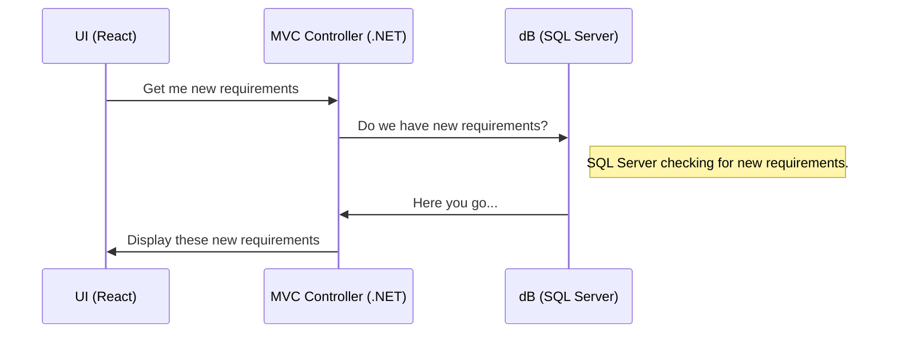
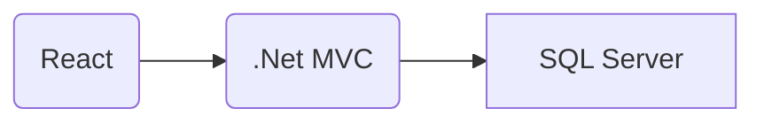

## Hello World!
> Welcome to my page. 
## About
> My name is **[Srinivas Pallikonda](https://pallikonda-srinivas.com)** and I am a Full Stack Web developer.
## Experience Summary
> Over 15 years of exeperience in IT industry having end to end knowledge of software development.
## Domain Expertise
> BFSI
> Hitec
> Healthcare
> ERP
## Education
>Masters in Computer Applications
>Bachelors in *Life Sciences*
## Design

Chat UML:


Resourcing:


## Markdown Test
```javascript
var experince = 15;
```

| Id  | Name  |
|---|---|
| 1  | John Doe  |
| 2  |  Jane Smith |
    
<!--stackedit_data:
eyJoaXN0b3J5IjpbMTMxNzMyMTc1OV19
-->